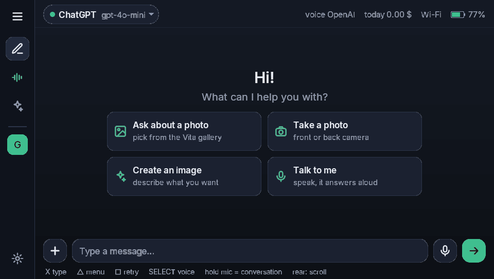
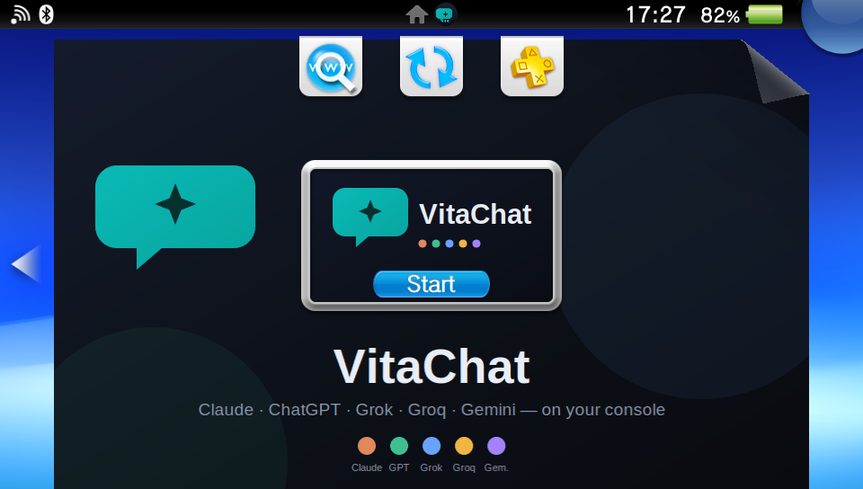

# VitaChat

AI chat for the PlayStation Vita. Talk to Claude, ChatGPT, Grok, Groq or Gemini, or any OpenAI-compatible service, right on your console.

**[⬇ Download the latest version](../../releases/latest)**

## Features

- **5 AI services + your own**: Claude, ChatGPT, Grok, Groq, Gemini, plus any OpenAI-compatible endpoint (OpenRouter, Ollama, LM Studio, …)
- **Pick the model** from the live model list of each service
- **Photos**: ask about a picture from the Vita gallery or take one with the front/back camera
- **Image generation** (OpenAI or Grok)
- **Voice**: hold the mic to talk, or use hands-free conversation mode
- **Claude extras**: web search, extended thinking, code execution
- **Memory**, **conversation history**, **cost tracking** with an optional daily limit
- **Landscape and portrait**
- **9 languages**: English, Română, Deutsch, Français, Italiano, Español, Português, Русский, Polski

## Requirements

- A PS Vita with homebrew enabled (HENkaku / h-encore / Ensō) and VitaShell
- Wi-Fi
- Your own API key for at least one service. **You pay the provider directly** for what you use. Groq and Gemini have free tiers.

Tested on PCH-1000 consoles.

## Install

1. Download `VitaChat-1.1.vpk` from [Releases](../../releases/latest).
2. Copy it to the Vita and install it with VitaShell. The extended-permissions warning is expected (network, camera, microphone).

## Adding your API keys

1. Open VitaChat → **Triangle** (menu) → **Set API key from phone**.
2. Scan the QR code with a phone on the **same Wi-Fi**.
3. Paste your key(s) and save. VitaChat recognises the service and tests the key.

| Service | Key page |
|---|---|
| Claude | console.anthropic.com |
| ChatGPT / OpenAI | platform.openai.com/api-keys |
| Grok | console.x.ai |
| Groq (free tier) | console.groq.com/keys |
| Gemini (free tier) | aistudio.google.com/apikey |

## Privacy

- Keys and conversations are stored **only on your console** (`ux0:data/vitachat/`).
- VitaChat talks only to the AI service you choose (and to your phone on the local network while you add a key). No analytics, no telemetry, no servers of its own.
- Don't share backups of `ux0:data/vitachat/`, because that folder contains your keys.

## Feature requests and bugs

Open an [issue](../../issues). Ideas are welcome.

## Support

VitaChat is free. If you enjoy it, a bottle of wine keeps the project alive: [ko-fi.com/misterious_falcon](https://ko-fi.com/misterious_falcon)

## License

VitaChat is freeware: free to download and use. See [LICENSE.txt](LICENSE.txt). Open-source components it includes: [THIRD_PARTY_NOTICES.md](THIRD_PARTY_NOTICES.md).

VitaChat is an unofficial fan project, not affiliated with Sony, Anthropic, OpenAI, xAI, Groq or Google.
